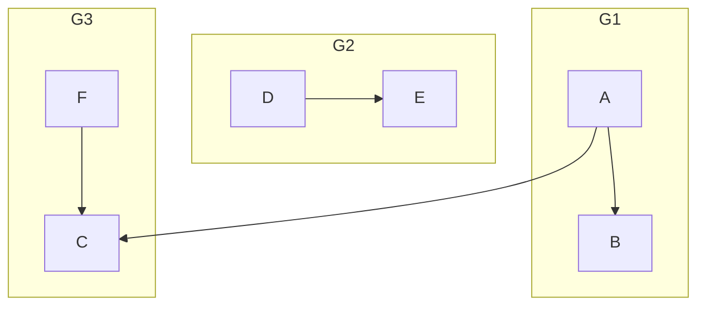
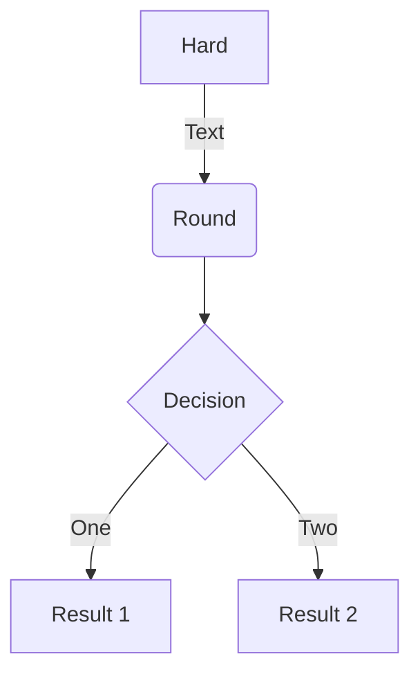

# Mermaid Diagram Example

```mermaid
graph TD
    A --> C
    subgraph G1
        A --> B
    end
    subgraph G2
        D --> E
    end
    subgraph G3
        F --> C
    end
```

```mermaid
graph TD
    A[Hard] -->|Text| B(Round)
    B --> C{Decision}
    C -->|One| D[Result 1]
    C -->|Two| E[Result 2]
```