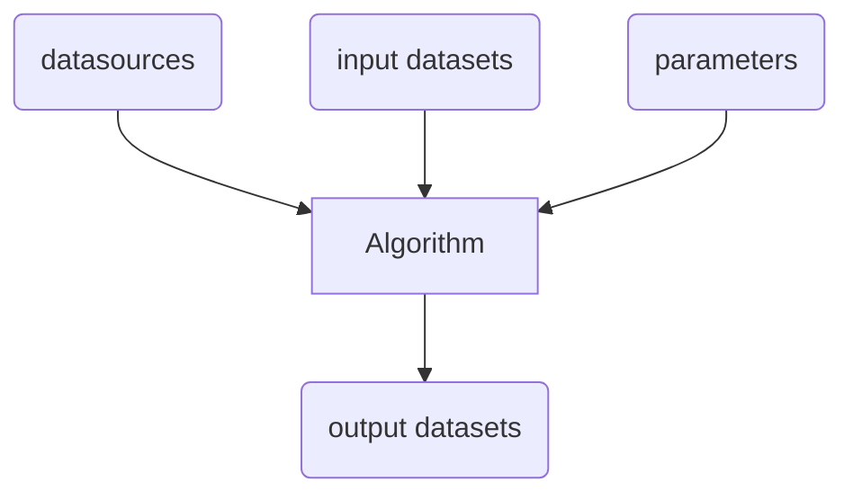
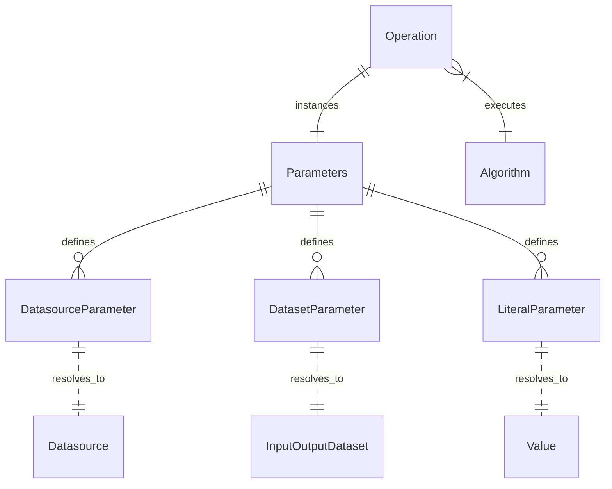
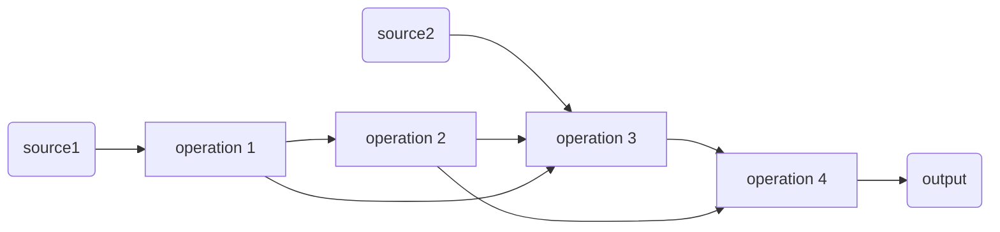

# Framework

## Algorithm, Parameters and Operation

The FCT provides a lightweight framework to execute chains of algorithms, which we will refer to as *workflows*.
An *algorithm* is a simple function that processes a set of input and produces a set of output.



If an algorithm could be any python function, the FCT framework provides a simple mechanism to define input and output by parameters that can be resolved at execution time using configuration.

We distinguish between 3 types of parameters :

- [Datasource parameters][fct.config.descriptors.DatasourceParameter]
   which resolve to [Datasources][fct.config.Configuration.DataSource]
- [Input/Output dataset parameters][fct.config.descriptors.LiteralParameter]
   which resolve to [Datasets][fct.config.Configuration.Dataset]
- [Literal parameters][fct.config.descriptors.LiteralParameter]
  which represent simple (string or numeric) values

Input and output datasets are basically the same thing :
some output become the input to another step in the workflow.
Datasources are input datasets that may reside anywhere outside the execution workspace, whereas datasets are resolved relatively to the current workspace location. One can think of datasources as primary data that need to be imported into the workspace, while datasets are first produced at some step before they are consumed by another one.

Datasources and datasets ultimately resolve to file names, and as such, they can represent anything that can be stored in a file. Algorithms are responsible for managing access to specific file formats.

In order to encourage consistent implementation of algorithms,
we define *`Parameters objects* and *operations* :

- *`Parameters` objects* represent a set of named parameters
  specific to some algorithm

- an *operation* is the realization of an algorithm,
  it is a function that instances a `Parameters` object,
  possibily binding concrete datasets to dataset parameters,
  and executes the algorithm with theses parameters.



As an example, we could define a new `FlowDirectionAlgorithm` along with its `Parameters` class as :

```python
from fct.config import DatasetParameter

class Parameters():
    """
    Flow direction parameters
    """

    elevations = DatasetParameter(
        'elevation raster (DEM)',
        type='input')

    flow = DatasetParameter(
        'flow direction raster',
        type='output')
    
    def __init__(self):
        """
        Default parameter values
        """

        self.elevations = 'dem-drainage-resolved'
        self.flow = 'flow'

def FlowDirectionAlgorithm(params: Parameters):
    """
    Algorithm stub
    """
    
    print(params.elevations.filename())
    print(params.flow.filename())
```

Finally, we could define a new operation that uses `FlowDirectionAlgorithm` to process specific input and output :

```python
@operation
def flow_direction():
    """
    FlowDirectionAlgorithm realization
    """

    # instances Parameters
    params = Parameters()
    params.elevations = 'other-dem'
    params.flow = 'other-flow'

    # executes algorithm
    FlowDirectionAlgorithm(params)
```

## Tileset

[Tileset][fct.config.Configuration.Tileset]

## Datasource and Dataset

## Workflow



## Configuration

[Configuration][fct.config.Configuration.Configuration]