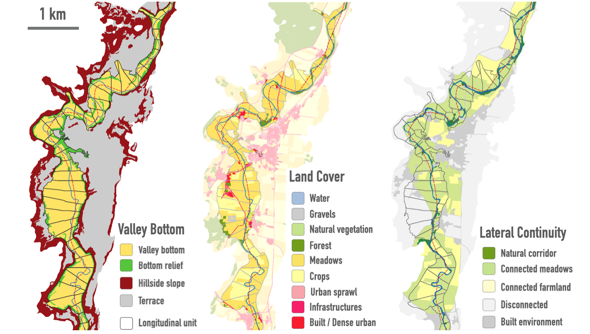
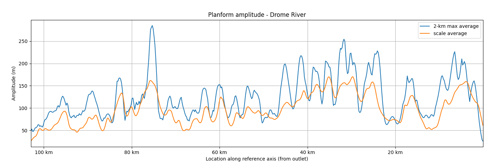

# Fluvial Corridor Toolbox

## Overview

The scope of the Fluvial Corridor Toolbox (FCT) is fluvial geomorphology at the network scale, sometimes called upscaled hydromorphology.

The toolbox enables mapping fluvial corridors and measuring river features from very large datasets.
We first developed the toolbox for the case of the French Rhone basin, which is 90 000 km^2 wide.

The overall goal of the toolbox is to propose a quantitative application of the river style framework to support evidence based river management and river condition monitoring in the context of integrated river management.

This new version of the Fluvial Corridor Toolbox (FCT) started as an effort to implement port the ArcGIS code (Roux et al., 2015) to the QGis platform for promoting open science and sharing our tools with river practitioners.

The new version has been completely rewritten and incorporates ideas from Nardi et al. (2018) and Clubb et al. (2017) for improving the calculation of riverscape feature heights above the water level and delineate floodplain through the river network.
We also borrowed the concept of swath profiles from Hergarten et al. (2014) as the basis of a new raster-based approach to characterize floodplain features on cross-sections.

These new functionalities are based on high resolution DEM and landcover data to produce nested floodplain envelops. Finally, we implemented tiled processing of very large raster datasets after Barnes (2016, 2017).
This new version of the FCT also provides a lightweight framework for developing new processing toolchains/workflows.

## Basin-wide cartography

The cartography of the [French Rhone Basin](https://ebf.mapkiwiz.fr/qwc)
is visible online as an example of the output of the FCT.

## Principles

- The FCT provides a framework to characterize river corridors at the network scale
- Enables the processing of high resolution datasets and/or wide watersheds
- Robust, reproducible and automated raster-based metrology
- FAIR and open source platform

## River Styles

Based on the FCT extracted metrics,
the river network can be segmented into functional units and classified into river styles.

A river style represents a type of river behavior.
River styles support better comparison between river reaches and are a useful tool to assess river condition.

## Workflows

The FCT implements a number of complex workflows :

- **Drainage network** derived from DEM's topography
- **Height maps** relative to the river or drainage network
- **Valley bottom delineation** from height and slope
- **Longitudinal reference system** for river characterization and monitoring
- **Lateral continuity**
- **Planform metrics**
- **Corridor metrics**

## Heights

- A. flow height (Nardi et al., 2018)
- B. shortest height
- C. height above nearest drainage
- D. height above floodplain

## Example Metrics

In order to measure and calculate metrics, the valley bottom is divided into longitudinal units of constant length. A number of metrics can be calculated by the toolbox.

See the full [list of metrics](metrics).

## Documentation

The project still lacks a thorough documentation,
but we strive to provide a working documentation as soon as possible.
