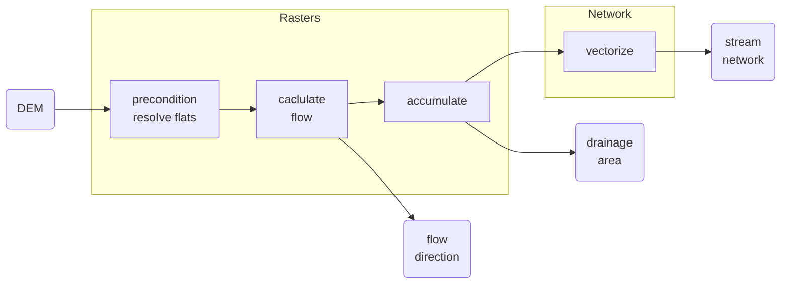

# Drainage

## Overview

::: workflows.DrainageRasters
    handler: python
    selection:
        members:
            - DrainageRastersWorkflow
    rendering:
        show_root_heading: false
        show_root_toc_entry: false
        show_source: true

::: workflows.DrainageNetwork
    handler: python
    selection:
        members:
            - DrainageNetworkWorkflow
    rendering:
        show_root_heading: false
        show_root_toc_entry: false
        show_source: true

## Operations

### Drainage rasters

::: workflows.DrainageRasters
    handler: python
    selection:
        filters:
            - "!^.*Workflow$"
    rendering:
        show_root_heading: false
        show_root_toc_entry: false
        heading_level: 4
        show_source: true

### Drainage network

::: workflows.DrainageNetwork
    handler: python
    selection:
        filters:
            - "!^.*Workflow$"
    rendering:
        show_root_heading: false
        show_root_toc_entry: false
        heading_level: 4
        show_source: true